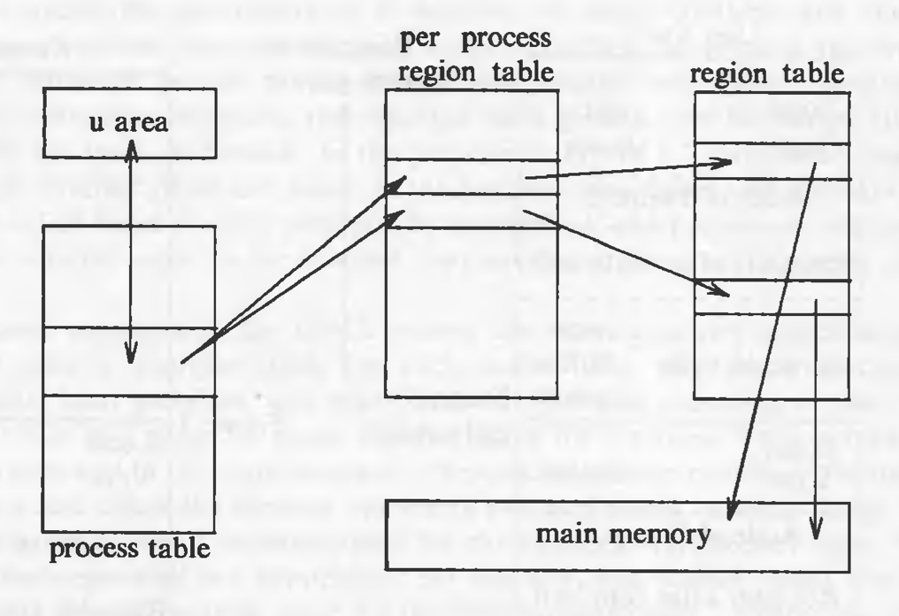
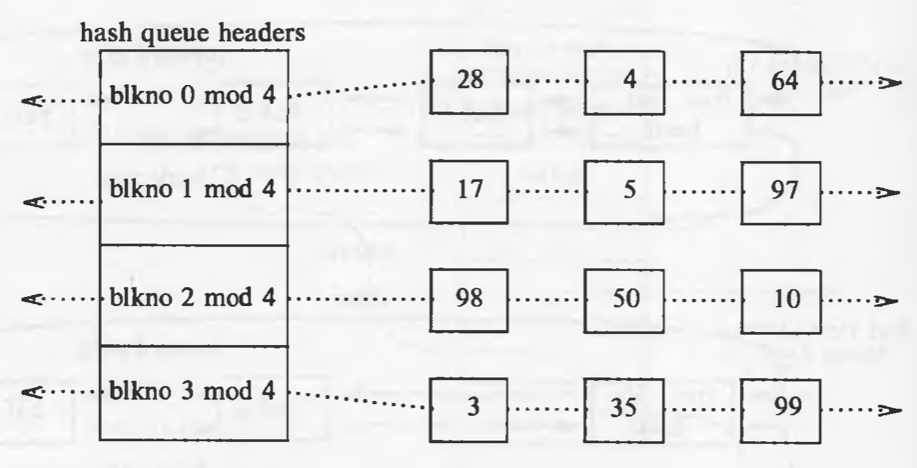
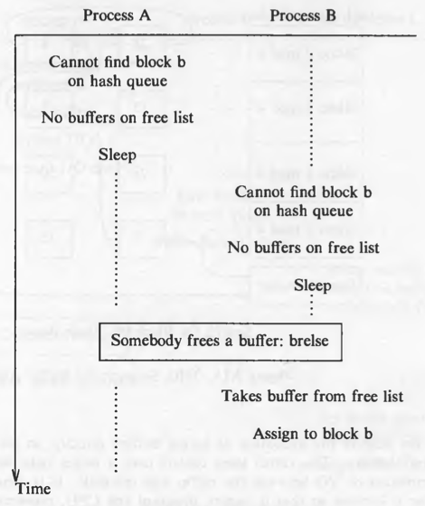
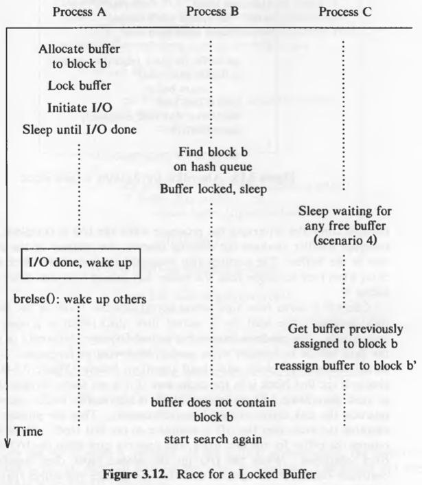

## Why UNIX became so popular

* Portable: written in a high-level language (C), making it easy to read, understand, change, and move to other machines.
* User-Friendly: A powerful, simple interface.
* Modular: Provides primitives for complex programs.
* Organised: It uses a hierarchical file system.
* Consistent: Uses the byte stream file format.
* Device-Agnostic: Uniform device interface.
* Multi-User/Process: Concurrent execution.
* Hardware Abstraction: Portability across systems.


## High-level Architecture of UNIX Systems


The operating systems interacts directly with the hardware, providing common services to programs and insulating them from hardware idiosyncrasies.
Programs such as the shell and editors shown in the outer layers interact with the kernel by invoking a well defined set of *system calls*.

## User Perspective

### The File System

* A hierarchical structure
* consistent treatment of file data
* the ability to create and delete files
* dynamic growth of files
* the protection of file data
* the treatment of peripheral devices as files

The file system is organized as a tree with a single root node called *root* (written '/'). Every non-leaf node of the file system structure is a *directory* of files, and files at the leaf nodes of the tree are either *directories*, *regular files*, or *special device files*.

## Operating System Services

These are the services provided by the kernel:

* Controlling the execution of processes by allowing their creation, termination or suspension, and communication.
* Scheduling processes fairly for execution of the CPU. Processes share the CPU in a *time-shared* manner: the CPU executes a process, the kernel suspends it when its time quantum elapses, and the kernel schedules another process to execute. The kernel later reschedules the suspended process.
* Allocating main memory for an executing process. The kernel allows processes to share portions of their address space under certain conditions, but protects the private address space of a process from outside tampering. If the system runs low on free memory, the kernel frees memory by writing a process temporarily to secondary memory, called a *swap* device. If the kernel writes entire processes to a swap device, the implementation of the UNIX system is called a *swapping* system; if it writes pages of memory to a swap device, it is called a *paging* system.
* Allocating secondary memory for efficient storage and retrieval of user data. This service constitutes the file system. The kernel allocates secondary storage for user files, reclaims unused storage, structures the file system in a well understood manner, and protects user files from illegal access.
* Allowing processes controlled access to peripheral devices such as terminals, tape drives, disk drives, and network devices.

## Assumptions about Hardware

The execution of user processes in a UNIX system is divided in two levels: user and kernel. When a process executes a system call, its execution mode changes from *user mode* to *kernel mode*. Even if the user process doesn't make a system call, the operating system still does bookkeeping work that relates to the user process, handling interrupts, scheduling processes, managing memory, and so on.

* Processes in user mode can access their own instructions and data. Processes in kernel mode however, can access kernel and user addresses.
* Some machine instructions are privileged and result in an error when executed in user mode.

### Multiple processes and modes of execution


In the diagram above, the operating system views from the top (or bottom), it sees which processes are running. However, the hardware view if from the left (or right), it sees which mode is currently active.

### Interrupts and Exceptions

The UNIX system allows devices such as I/O peripherals or the system clock to interrupt the CPU asynchronously. On receipt of an interrupt, the kernel saves its current *context* (a frozen image of what the processor was doing), determines the cause of the interrupt, and services the interrupt. After servicing the interrupt, it restores its interrupted context and begins execution as if nothing had happened. The hardware usually prioritizes devices according to the order that interrupts should be handled: When the kernel services an interrupt, it *blocks* out lower priority interrupts but services higher priority interrupts.

An exception condition refers to unexpected events caused by a process, such as addressing illegal memory, executing privileged instructions, dividing by zero, and so on. They are distinct from interrupts, which are caused by events that are external to a process.

Exceptions happen "in the middle" of the execution of an instruction, and the system attempts to restart the instruction after handling the exception; interrupts are considered to happen between the execution of two instruction, and the system continues with the next instruction after servicing the interrupt. The UNIX system uses one mechanism to handle interrupts and exception conditions.

### Processor Execution Levels

The kernel sometimes wants to prevent occurrence of interrupts when it is doing some important work (such as modifying kernel data structures). In such situations, if the interrupts are not prevented, the kernel itself might get corrupt. Computers typically have a set of privileged instructions that set the processor execution level in the processor status word. Setting the processor execution level to certain values masks off interrupts from the level and lower levels, allowing only higher-level interrupts.


### Memory Management

The kernel permanently resides in the main memory. When compiling a program, the compiler generates a set of addresses in the program that represent addresses of variables and data structures of the addresses of instructions such as functions. The compiler generates the addresses for a *virtual machine* as if no other program will execute simultaneously on the physical machine. When the program is run on the machine, the kernel allocates space in main memory for it, but the virtual addresses generated by the compiler need not be identical to the physical addresses that they occupy in the machine. The kernel coordinates with the machine hardware to set up a virtual to physical address translation that maps the compiler-generated addresses to the physical machine addresses.

# Introduction to the Kernel

## Architecture of the UNIX Operating System

The UNIX system supports the illusions that the file system has "places" and that processes have "life".

The two entities, files and processes, are the two central concepts in the UNIX system model.


* The *file subsystem* is on the left and the *process control subsystem* is on the right.
* The diagram shows 3 levels : user, kernel, and hardware.
* The system call and library interface represent the border between user programs and the kernel.

## Introduction to System Concepts

### An Overview of the File Subsystem

Internal representation of a file is given by an *inode*, which contains a description of the disk layout of the file data and other information such as the file owner, access permissions, and access times. The term inode is a contraction of the term *index node*. Every file has one inode, but it may have several names, all of which map into the inode. Each name is called a *link*. When a process creates a new file, the kernel assigns it an unused inode.

Inodes are stored in the file system, but the kernel reads them into an in-core (in-memory) inode table when manipulating files. The kernel contains two other data structures, the *file table* and the *user file descriptor table*. The file table is a global kernel structure, but the user file descriptor table is allocated per process. When a process *open*s or *creat*s a file, the kernel allocates an entry from each table, corresponding to the file's inode. Entries in the three structures -- user file descriptor table, file table, and inode table -- maintain the state of the file and the user's access to it.  The file table keeps track of the byte offset in the file where the user's next *read8 or *write* will start, and the access rights allowed to the *open*ing process. The user file descriptor table identifies all open files for a process.


The kernel returns a *file descriptor* for the *open* and *creat* system calls, which is an index into the user file descriptor table. These three tables also enable sharing of files.

On a logical level, the kernel deals with file systems rather than with disks. It treats each file system as a *logical device* identified by a logical *device number*.

A file system consists of a sequence of logical blocks, each containing 512, 1024, 2048, or any convenient multiple of 512 bytes. The size of a local block is homogeneous within a file system but may vary between different file systems in a system configuration.

In this text, the size of a "block" is assumed to be 1K, unless stated otherwise.


A file system has the following structure:

* The *boot block* occupies the beginning of a file system, typically the first sector, and may contain the *bootstrap* code that is read into the machine to *boot* , or initialize, the operating system. Although only one boot block is needed to boot the system, every file system has a (possibly empty) boot block.
* The *super block* describes the state of a file system -- how large it is, how many files it can store, where to find free space on the file system, and other information.
* The *inode list* is a list of inodes that follows the super block in the file system. Administrators specify the size of the inode list when configuring a file system. The kernel references inodes by index into the inode list. One inode is the *root inode* of the file system: it is the inode by which the directory structure of the file system is accessible after execution of the *mount* system call.
* The data blocks start at the end of the inode list and contain file data and administrative data. An allocated data block can belong to one and only one file in the file system.

## Processes

A process is the execution of a program and consists of a pattern of bytes that the CPU interprets as machine instructions (called *text*), *data*, and *stack*. Processes communicate with other processes and with the rest of the world via system calls.

A process on a UNIX system is the entity that is created by the *fork* system call. Every process except *process 0* is created when another process executes the *fork* system call. The process which invoked fork system call is called the parent process and the newly created process is called the child process. A process can have only one parent process but it can have many child processes. The kernel identifies each process by its process number, called the *process ID* (PID). Process 0 is a special process that is created "by hand" when the system boots; after *fork*ing a child  process (process 1), process 0 becomes the *swapper* process. Process 1, known as *init* is the ancestor of every other process.

An executable file consists of the following parts:

* a set of "headers" that describe the attributes of the file
* the program text
* a machine language representation of the data that has initial values when the program starts execution, and an indication of how much space the kernel should allocate for uninitialized data, called *bss* (block started by symbol).
* other sections, such as symbol table information.

```
#include <stdio.h>

char buffer[2048];
int version = 1;

main() {
	printf("Hello, world!");
}
```

In the code given above, the initialized data is the variable `version` and the uninitialized data (i.e *bss*) is the array `buffer`.

The kernel loads an executable file into memory during an *exec* system call, and the loaded process consists of at least three parts, called *regions*: text, data, and stack. The text and data regions correspond to the text and data-bss sections of the executable file, but the stack region is automatically created and its size is dynamically adjusted by the kernel at runtime. The stack consists of logical *stack frames* that are *push*ed when calling a function and *pop*ped when returning; a special register called the *stack pointer* indicates the current stack depth. A stack frame consists of parameters to a function, its local variables and the data necessary to recover the previous stack frame, including the value of the program counter and stack pointer at the time of the function call.

Because a process in the UNIX system can execute in two modes, kernel or user, it uses a separate stack for each mode. When a system call is made, a *trap* instruction is executed which causes an *interrupt* which makes the hardware switch to kernel mode. The kernel stack of a process is null when the process executes in user mode.


Every process has an entry in the kernel *process table*, and each process is allocated a *u area* ("u" stands for "user") that contains private data manipulated only by the kernel. The process table contains (or points to) a *per process region table*, whose entries point to entries in a *region table*. A region is a contiguous area of a process's address space, such as text, data, and stack. Region table entries describe the attributes of the region, such as whether it contains text or data, whether it is shared or private, and where the "data" of the region is located in memory. The extra level of indirection (from the per process region table to the region table) allows independent processes to share regions.



Important fields in the process table are:

* a state field
* identifiers indicating the user who owns the process (user IDs, or UIDs)
* an event descriptor set when a process is suspended (in the *sleep* state)

The u area contains information that needs to be accessible only when the process is executing. Important fields in the u area are:

* a pointer to the process table slot of the currently executing process
* parameters of the current system call, return values and error codes
* file descriptors for all open files
* internal I/O parameters
* current directory and current root
* process and file size limits

The kernel internally uses a structure variable *u* which points to the u area of the currently executing process. When another process executes, the kernel rearranges its virtual address space that *u* refers to the u area of the new process.

## Context of a process

Context of a process consists of the following:

* text region
* values of global variables and data structures
* values of machine registers
* values stored in its process table slot
* u area
* contents of user and kernel stacks

The text of the operating system and its global data structures are shared by all processes but do not constitute part of the context of a process.

When the kernel decides that it should execute another process, it does a *context switch*, so that the system executes in the context of the other process.

The kernel services the interrupts in the context of the interrupted process even though it may not have caused the interrupt. Interrupts are served in kernel mode.

## Process states

1. Process is currently executing in user mode.
2. Process is currently executing in kernel mode.
3. Process is not executing, but it is ready to run as soon as the scheduler chooses it.
4. Process is sleeping.

Because a processor can execute only one process at a time, at most one process may be in states 1 and 2.

## State transitions

Processes move continuously between the states according to well-defined rules. A *state transition* diagram is a directed graph.


By prohibiting arbitrary context switches and controlling the occurrence of interrupts, the kernel protects its consistency.

The kernel allows a context switch only when a process moves from the state "kernel running" to the state "asleep in memory". Processes running in kernel mode cannot be preempted by other processes; therefore the kernel is sometimes said to be *non-preemptive*.

Consider the following code snippet:

```
struct queue {

} *bp, bp1;

bp1->forp = bp->forp;
bp1->backp = bp
bp->forp = bp1;
// consider possible context switch here
bp1->forp->backp = bp1;
```

In the above code, we are trying to put a new node into a doubly linked list. Kernel uses many such doubly linked lists as its data structures. While inserting the node in the list, if a context switch occurs at the specified line, it will have incorrect links. If other process modifies the list, it will get corrupt.


Therefore, when entering *critical* regions of the code, kernel raises its processor execution level to prevent interrupts.

The process scheduler periodically preempts processes executing in user mode so that processes cannot monopolize use of the CPU.

## Sleep and wakeup

A process changes its state on its own will. Other processes can communicate with it and suggest various alternatives. But the final decision is made by the process on its own initiative. Consequently, an interrupt handler cannot go to sleep, because if it could, the interrupted process would be put to sleep by default.

Process always *sleep on an event*, meaning that they are in the sleep state until the event occurs, at which time they wake up and enter the state "ready to run". Many processes can simultaneously sleep on an event. When that event occurs, *all* the processes wake up because the event condition is no longer true. They transition from "sleep" state to "ready to run" state. Sleeping processes do not consume CPU resources. The kernel does not constantly check to see that a process is still sleeping but waits for the event to occur and awakens the process then.

The kernel, while modifying a critical data structure, always checks if some other process has locked the data structure. If yes, it *sleep*s on the event of the data structure being unlocked. After it is unlocked, the process will *wakeup* and lock the data structure so that it can modify it. The kernel implements such locks in the following manner:

```
while (condition is true)
	sleep (event: the condition becomes false);
set condition true;
```

It unlocks the lock and awakens all processes asleep on the lock in the following manner:

```
set condition false;
wakeup (event: the condition is false);
```

Example of 3 processes waiting for a the same buffer.


## Kernel Data Structures

Most kernel data structure have fixed size rather than dynamically allocated space.

This decision was taken to make the kernel code simple. But the disadvantage is that kernel cannot be configured dynamically. If, at runtime, kernel hits the limit of some data structure, it has to throw errors. But such situations occur **very** rarely.

## System Administration

Conceptually, there is no difference between system administrative processes and user processes. It's just that the system administrative processes have more rights and privileges. Internally, the kernel distinguishes a special user called the *superuser*. A user may become a superuser by going through a login-password sequence or by executing special programs.

# The Buffer Cache

The kernel could read and write directly to and from the disk for all the file system accesses, but system response time and throughput will be poor because of the slow disk transfer rate. The kernel therefore attempts to minimize the frequency of disk access by keeping a pool of data buffers, called the *buffer cache*, which contains data in recently used disk blocks.

Architecturally, it is positioned between file subsystem and device drivers.

## Buffer Headers

During system initialization, the kernel allocates space for a number of buffers, configurable according to memory size and performance constraints.

Two parts of the buffer:

1. a memory array that contains data from the disk.
2. *buffer header* that identifies the buffer.

Data in a buffer corresponds to data in a logical disk block on a file system. A disk block can **never** map into more than one buffer at a time.


The *device number* fields specifies the logical file system (not physical device) and *block number* block number of the data on disk. These two numbers *uniquely* identify the buffer. The *status* field summarizes the current status of the buffer. The *ptr to data area* is a pointer to the data area, whose size must be at least as big as the size of a disk block.

The status of a buffer is a combination of the following conditions:

* Buffer is locked / busy
* Buffer contains valid data
* Kernel must write the buffer contents to disk before reassigning the buffer; called as "delayed-write"
* Kernel is currently reading or writing the contexts of the buffer to disk
* A process is currently waiting for the buffer to become free.

The two set of pointers in the header are used for traversal of the buffer queues (doubly linked circular lists).

## Structure of the Buffer Pool

The kernel follows the *least recently unused (LRU)* algorithm for the buffer pool. The kernel maintains a *free list* of buffers that preserves the least recently used order. Dummy buffer header marks the beginning and end of the list. All the buffers are put on the free list when the system is booted. When the kernel wants *any* buffer, it takes it from the head of the free list. But it can also take a specific buffer from the list. The used buffers, when become free, are attached to the end of the list, hence the buffers closer and closer to the head of the list are the least recently used ones.


When the kernel accesses a disk block, it searches for the buffer with the appropriate device-block number combination. Rather than search the entire buffer pool, it organizes the buffers into separate queues, *hashed* as a function of the device and block number. The hash queues are also doubly linked circular lists. A hashing function which uniformly distributes the buffers across the lists is used. But it also has to be simple so that the performance does not suffer.



The hash function shown in the figure only depends on the block number; real hash functions depend on device number as well.

Every disk block in the buffer pool exists on one and only one hash queue and only once on that queue. However, presence of a buffer on a hash queue does not mean that it is busy, it could well be on the free list as well if its status is free.

Therefore, if the kernel wants a particular buffer, it will search it on the queue. But if it wants *any* buffer, it removes a buffer from the free list. **A buffer is always on a hash queue, but it may or may not be on the free list**

## Scenarios for Retrieval of a Buffer

The algorithms for reading and writing disk blocks use the algorithm *getblk* to allocate buffers from the pool. There are 5 typical scenarios the kernel may follow in *getblk* to allocate a buffer for a disk block.

1. Block is found on its hash queue and its buffer is free.
2. Block could not be found on the hash queue, so a buffer from the free list is allocated.
3. Block could not be found on the hash queue, and when allocating a buffer from free list, a buffer marked "delayed write" is allocated. Then the kernel must write the "delayed write" buffer to disk and allocate another buffer.
4. Block could not be found on the hash queue and the free list of buffers is empty.
5. Block was found on the hash queue, but its buffer is currently busy.

The algorithm *getblk* is given below (scenarios stated above are marked in the comments) :

```
/*
 *  Algorithm: getblk
 *  Input: file system number
 *          block number
 *  Output: locked buffer that can now be used for block
 */

{
	while (buffer not found)
	{
		if (block in hash queue)
		{
			if (buffer busy)   // scenario 5
			{
				sleep (event: buffer becomes free);
				continue;      // back to while loop
			}
			mark buffer busy;  // scenario 1
			remove buffer from free list;
			return buffer;
		}
		else
		{
			if (there are no buffers on the free list)
			{
				sleep (event: any buffer becomes free);   // scenario 4
				continue;      // back to while loop
			}
			remove buffer from free list;
			if (buffer marked for delayed write)         // scenario 3
			{
				asynchronous write buffer to disk;
				continue:      // back to while loop;
			}
			// scenario 2
			remove buffer from old hash queue;
			put buffer onto new hash queue;
			return buffer;
		}
	}
}

```

When using the buffer, the kernel always marks the buffer as busy so that no other process can access it. When the kernel finishes using the buffer, it releases the buffer according to the algorithm *brelse*.

The algorithm *brelse* is given below :

```
/*  Algorithm: brelse
 *  Input: locked buffer
 *  Output: none
 */
 
{
	wakeup all processes (event: waiting for any buffer to become free;
	wakeup all processes (event: waiting for this buffer to become free;
	raise processor execution level to block interrupts;
	if (buffer contents valid and buffer not old)
		enqueue buffer at end of free list;
	else
		enqueue buffer at beginning of free list;
	lower processor execution level to allow interrupts;
	unlock (buffer);
} 
```

Buffer contents are old only if it is marked as "delayed write", in that case and in the case where the data is not valid (for example, due to I/O corruption), the buffer is put in the beginning of the free list as its data is not valid or old. Otherwise the data is valid as the buffer is put at the end to follow the LRU strategy.

The states of hash queues for different scenarios are shown in following figures :

Scenario 1


Scenario 2

Here the buffer is not on the hash queue, so a buffer from free list is removed and then its device and block numbers are changed.


Scenario 3


Scenario 4


Race for free buffer



Scenario 5


Race for a locked buffer **(this is an important race condition)**



**The kernel guarantees that all processes waiting for buffers will wake up, because it allocates buffers during execution of system calls and frees them before returning.**


## Reading and Writing Disk Blocks

This is the algorithm (*bread*) for reading data from the disk:

```
/*  Algorithm: bread
 *  Input: file system number
 *         block number
 *  Output: buffer containing data
 */
 
{
	get buffer for block (algorithm: getblk);
	if (buffer data valid)
		return buffer;
	initiate disk read;
	sleep (event: disk read complete);
	return buffer;
}
```

If the data is not found in the buffer pool, the kernel initiates disk read. The driver "schedules" a read request to the disk controller, which copies the data from the disk to the buffer and then the disk interrupt handler awakens the sleeping process.

The higher level algorithms anticipate the need for the next disk block if a sequential file access is being done. The second read is asynchronous. The kernel expects the data to be there for the second block when it wants.

The algorithm *breada* (bread-ahead) is given below:

```
/*  Algorithm: breada
 *  Input: file system number and block number for immediate read
 *         file system number and block number for asynchronous read
 *  Output: buffer containing data for immediate read
 */
 
{
	if (first block not in cache)
	{
		get buffer for first block (algorithm: bread);
		if (buffer data not valid)
			initiate disk read;
	}
	if (second block not in cache)
	{
		get buffer for second block (algorithm: getblk);
		if (buffer data valid)
			release buffer (algorithm: brelse);
		else
			initiate disk read;
	}
	if (first block was originally in the cache)
	{
		read first block (algorithm: bread);
		return buffer;
	}
	sleep (event: first buffer contains valid data);
	return buffer;
}
```

Note: in the algorithm above, the line: `get buffer for first block (algorithm: bread)` is not correct in my opinion. The algorithm here should be `getblk` and not `bread` as we are checking for validity and initiating a disk read both of which are done internally in `bread`. So the algorithm here should be `getblk`. It might just be a printing mistake in the book.

If we get the data for the second block in the buffer cache, we release it immediately as we do not need it right away. It will be acquired when the data is actually needed.

The algorithm (*bwrite*) for writing contents of a buffer to a disk block is given below:

```
/*  Algorithm: bwrite
 *  Input: buffer
 *  Output: none
 */

{
	initiate disk write;
	if (I/O synchronous)
	{
		sleep (event: I/O complete);
		release buffer (algorithm: brelse);
	}
	else if (buffer marked for delayed write)
			mark buffer to put at head of free list;
}
```

Because of the two asynchronous I/O operations -- block read ahead and delayed write -- the kernel can invoke *brelse* from an interrupt handler. Hence, it must prevent interrupts in any procedure that manipulates the buffer free list.
