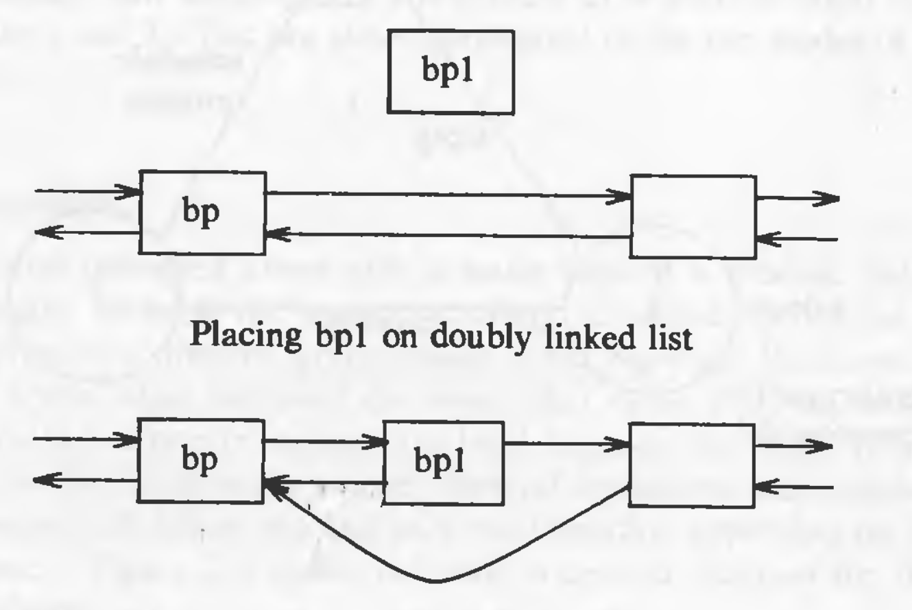
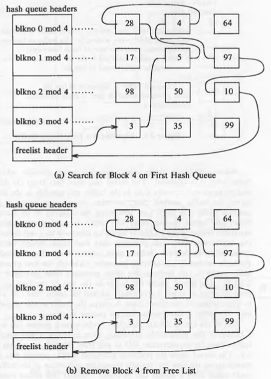

# Unit 01

## Why UNIX became so popular

* Portable: written in a high-level language (C), making it easy to read, understand, change, and move to other machines.
* User-Friendly: A powerful, simple interface.
* Modular: Provides primitives for complex programs.
* Organised: It uses a hierarchical file system.
* Consistent: Uses the byte stream file format.
* Device-Agnostic: Uniform device interface.
* Multi-User/Process: Concurrent execution.
* Hardware Abstraction: Portability across systems.


## High-level Architecture of UNIX Systems


* Layer-1: Hardware: It consists of all hardware related information.
* Layer-2: Kernel: This is the core of the Operating System. It is a software that acts as the interface between the hardware and the software. Most of the tasks like memory management, file management, network management, process management, etc., are done by the kernel.
* Layer-3: Shell commands: This is the interface between the user and the kernel. Shell is the utility that processes your requests. When you type in a command at the terminal, the shell interprets the command and calls the program that you want. There are various commands like cp, mv, cat, grep, id, wc, nroff, a.out and more.
* Layer-4: Application Layer: It is the outermost layer that executes the given external applications.
  
* The operating systems interacts directly with the hardware, providing common services to programs and insulating them from hardware idiosyncrasies.
Programs such as the shell and editors shown in the outer layers interact with the kernel by invoking a well defined set of *system calls*.

## User Perspective

### Shell

* The OS provides a command-line interface or shell to interact with files, processes, and system services
  
### The File System

* Hierarchical Structure: Tree-like organisation with a root ('/').
* Consistent Data: Uniform treatment of file content.
* File Management: Create and delete files easily.
* Dynamic Growth: Files can expand as needed.
* Data Protection: Security mechanisms for file access.
* Devices as Files: Unified interface for peripherals.
* Nodes:
  - Root: top-level directory.
  - Directories: Organise files (non-leaf nodes).
  - Files: Data storage (leaf nodes: directories, regular files, special device files).
 
### Process

* Users can run commands, scripts, and applications, and manage system resources indirectly via system calls or shell commands.
  

## Operating System Services

* Process Control: Allows creation, termination, suspension, and communication between processes.
* CPU Scheduling: Shares CPU time fairly among processes using time-sharing and context switching.
* Main Memory Management: Allocates memory to processes, protects address spaces, and supports memory sharing.
* Swapping/Paging: Frees memory by moving processes or pages to swap space when memory is low.
* File System Management: Allocates and reclaims secondary storage, structures the file system, and protects user data.
* Device Access: Enables controlled access to I/O devices like disks, terminals, and network interfaces.
* Transparency: Hides internal file formats and device distinctions, returning simple byte streams to processes.
* Shell Support: Provides services like input reading, process spawning, piping, and I/O redirection to enable shell functionality.
* Customizability: Supports user-built environments (e.g., custom shells) using the same kernel services.

## Assumptions about Hardware

* **Execution Modes**

  * User Mode: Limited access to user data and instructions.
  * Kernel Mode: Full access to system memory and devices.
  * System Calls: Switch execution from user to kernel mode.

* **Privileged Instructions**

  * Executable only in kernel mode.
  * Prevent unauthorized access to system-level operations.

* **Kernel-User Relationship**

  * Kernel runs as part of user processes.
  * Handles system-level tasks on behalf of the user process.

* **Operating System View and Hardware View**

  * OS sees which *process* is running.
  * Hardware sees which *mode* is active.

  

* **Interrupts**

  * Triggered by external devices (e.g., clock, I/O).
  * Kernel saves context, handles the event, and resumes execution.
  * Prioritized handling based on importance.

* **Exceptions**

  * Caused by process errors (e.g., divide by zero, illegal memory).
  * Handled mid-instruction and resumed afterward.
  * Treated differently from hardware interrupts.

* **Unified Handling**

  * Single mechanism used to manage both interrupts and exceptions.

* **Processor Execution Levels**

  * Kernel masks lower-priority interrupts during critical operations.
  * Execution level set using privileged instructions.

  

* **Memory Management**

  * Kernel resides permanently in main memory.
  * Compiler generates virtual addresses.
  * Kernel maps virtual to physical addresses using hardware.
  * Supports techniques like paging.


# Introduction to the Kernel

## Architecture of the UNIX Operating System

The UNIX system supports the illusions that the file system has "places" and that processes have "life".

The two entities, files and processes, are the two central concepts in the UNIX system model.


* The *file subsystem* is on the left and the *process control subsystem* is on the right.
* The diagram shows 3 levels : user, kernel, and hardware.
* The system call and library interface represent the border between user programs and the kernel.

* **Core Concepts**

  * UNIX centers around two key entities: **files** and **processes**.
  * The kernel is divided into two subsystems: **File Subsystem** and **Process Control Subsystem**.

* **System Structure**

  * Three layers: **User**, **Kernel**, and **Hardware**.
  * **System Call Interface**: Boundary between user programs and kernel.

* **Libraries and System Calls**

  * System calls look like C functions.
  * Libraries translate these into system-level operations.
  * Assembly code can call system calls directly.

* **File Subsystem**

  * Manages files, space allocation, access permissions.
  * System calls: `open`, `read`, `write`, `close`, `stat`, `chown`, `chmod`.
  * Uses **buffer cache** for efficient I/O.
  * Interacts with:

    * **Block I/O drivers** (e.g., disk).
    * **Character/raw I/O drivers** (e.g., terminals, tapes).

* **Process Control Subsystem**

  * Handles:

    * Process creation & termination
    * Process scheduling
    * Memory management
    * Inter-process communication
  * System calls: `fork`, `exec`, `exit`, `wait`, `brk`, `signal`.

* **Memory Management**

  * Allocates memory fairly across processes.
  * Swaps processes between main and secondary memory if needed.
  * Two policies: **Swapping** and **Demand Paging**.
  * **Swapper**: Manages memory allocation (not to be confused with CPU scheduler).

* **CPU Scheduler**

  * Allocates CPU based on priority and time quantum.
  * Preempts processes that exceed their time slice.

* **Interprocess Communication**

  * Includes:

    * **Signals** (asynchronous)
    * **Message passing** (synchronous)

* **Hardware Control**

  * Manages hardware interrupts (e.g., from disk or terminal).
  * Interrupts are serviced by **kernel functions**, not separate processes.
  * After servicing, the interrupted process resumes.

## Introduction to System Concepts

### An Overview of the File Subsystem

* **Inode (Index Node)**

  * Internal representation of a file.
  * Stores: file metadata (owner, permissions, timestamps, disk layout).
  * Each file has **one inode**; multiple file names (links) can map to it.
  * Assigned by kernel when a new file is created.

* **In-Core Structures**

  * **Inode Table**: Maintained in memory for file access.
  * **File Table**: Global; tracks open files, byte offset, access rights.
  * **User File Descriptor Table**: Per-process; stores open file descriptors.

* **File Access Mechanism**

  * `open()` / `creat()` create entries in all three tables.
  * File descriptor returned → index into the user file descriptor table.
  * `read()` / `write()` follow file descriptor to inode via table pointers.


### **Logical vs Physical Devices**

* **Logical Devices**

  * Kernel treats file systems as logical devices with unique device numbers.
  * Device drivers map **logical addresses** to **physical disk locations**.

* **Disk Usage**

  * UNIX uses **disks**, not tapes, for file systems.
  * File systems can be partitioned for easier management.

---

### **File System Layout**

* **Logical Block**

  * Basic unit of file system storage (typically **1K bytes**).
  * Size is uniform within a file system but can differ across systems.
  * Larger blocks = faster transfer; too large = wasted space.

---


---

* **Boot Block**

  * First block in the file system.
  * May contain bootstrap code (to boot the OS).
  * Present in all file systems (even if unused).

* **Super Block**

  * Contains metadata: size, free space, file limits.
  * Essential for managing the file system state.

* **Inode List**

  * Contains all file inodes.
  * One inode is designated as the root inode (for mounting).
  * Size set during file system configuration.

* **Data Blocks**

  * Store actual file content and admin data.
  * Each block belongs to only one file.

## Processes

* **Definition**

  * A process is the execution of a program.
  * Consists of: **text** (instructions), **data**, and **stack**.
  * Communicates with others via **system calls**.

---

* **Process Creation**

  * Created using the `fork()` system call.
  * **Parent process** creates a **child process**.
  * All processes (except **process 0**) are created this way.
  * **Process 0** is manually created during boot → becomes the **swapper**.
  * **Process 1 (init)** is the ancestor of all other processes.

---

* **Executable File Structure**

  * Headers: file attributes.
  * Program text: machine instructions.
  * Initialized data: stored in the executable (e.g., `int version = 1;`).
  * Uninitialized data: `bss` section (e.g., `char buffer[2048];`).
  * Other info: symbol tables, etc.

```c
char buffer[2048];  // bss
int version = 1;    // initialized data
```

---

* **Memory Regions After `exec()`**

  * **Text**: code section.
  * **Data**: initialized + bss section.
  * **Stack**: created at runtime, grows dynamically.

    * Holds: function parameters, local vars, return data.

---

* **Stacks**

  * **User Stack**: used during user mode execution.
  * **Kernel Stack**: used after system call (kernel mode).
  * Switch triggered via a **trap instruction** on system call.


---

* **Process Data Structures**

  * **Process Table**:

    * Holds global process info (PID, state, UID, etc.)
  * **u Area**:

    * Kernel-only memory space.
    * Stores process-specific runtime data.

* **Process Table Fields**

  * State (running, sleeping, etc.)
  * User ID (UID)
  * Event descriptor for sleeping state

* **u Area Fields**

  * Pointer to process table entry
  * System call parameters, return values, error codes
  * Open file descriptors
  * I/O parameters
  * Current directory and root
  * Size limits (file/process)


---

* **Memory Regions and Sharing**

  * Managed via:

    * **Per-Process Region Table** → links to global **Region Table**
  * Supports:

    * Shared memory across processes
    * Copy-on-write on `fork()`
    * Memory release on `exit()`

---

## Context of a process

* **Context includes:**

  * Program code (text)
  * Global variables and data
  * CPU registers
  * Process table slot
  * u area
  * User and kernel stacks

* **Not included:**

  * OS code and global kernel data (shared by all processes)

* **Context Switch:**

  * Happens when the system switches from one process to another
  * Saves current process state and loads the new one

* **Mode Switch ≠ Context Switch:**

  * Switching between user ↔ kernel mode is **not** a context switch

* **Interrupt Handling:**

  * Interrupts are served **in kernel mode**
  * Handled **within the context** of the interrupted process

---


## Process states

1. Process is currently executing in user mode.
2. Process is currently executing in kernel mode.
3. Process is not executing, but it is ready to run as soon as the scheduler chooses it.
4. Process is sleeping.

Because a processor can execute only one process at a time, at most one process may be in states 1 and 2.

## State transitions

* Processes move continuously between states according to well-defined rules.

* A **state transition diagram** represents:

  * **Nodes:** process states
  * **Edges:** events triggering transitions


* The kernel **allows context switches only** when a process moves from **kernel running** → **asleep in memory**.

* Processes running in kernel mode are **non-preemptive** (cannot be interrupted by others).

* This protects kernel data structures from corruption during critical operations.

* **Example: Inserting a node `bp1` into a doubly linked list**

  ```c
  bp1->forp = bp->forp;
  bp1->backp = bp;
  bp->forp = bp1;
  // possible context switch here
  bp1->forp->backp = bp1;
  ```

* If a context switch happens at the marked line, the linked list becomes inconsistent, risking corruption if modified by another process.



* To avoid this, the kernel:

  * Raises the **processor execution level** during **critical regions** to block interrupts.
  * Critical regions are small code sections that manipulate shared kernel data.

* User-mode processes are **periodically preempted** by the scheduler to prevent CPU monopolization.

---

## Sleep and wakeup

A process changes its state on its own will. Other processes can communicate with it and suggest various alternatives. But the final decision is made by the process on its own initiative. Consequently, an interrupt handler cannot go to sleep, because if it could, the interrupted process would be put to sleep by default.

Process always *sleep on an event*, meaning that they are in the sleep state until the event occurs, at which time they wake up and enter the state "ready to run". Many processes can simultaneously sleep on an event. When that event occurs, *all* the processes wake up because the event condition is no longer true. They transition from "sleep" state to "ready to run" state. Sleeping processes do not consume CPU resources. The kernel does not constantly check to see that a process is still sleeping but waits for the event to occur and awakens the process then.

The kernel, while modifying a critical data structure, always checks if some other process has locked the data structure. If yes, it *sleep*s on the event of the data structure being unlocked. After it is unlocked, the process will *wakeup* and lock the data structure so that it can modify it. The kernel implements such locks in the following manner:

```
while (condition is true)
	sleep (event: the condition becomes false);
set condition true;
```

It unlocks the lock and awakens all processes asleep on the lock in the following manner:

```
set condition false;
wakeup (event: the condition is false);
```

Example of 3 processes waiting for a the same buffer.


## Kernel Data Structures

Most kernel data structure have fixed size rather than dynamically allocated space.

This decision was taken to make the kernel code simple. But the disadvantage is that kernel cannot be configured dynamically. If, at runtime, kernel hits the limit of some data structure, it has to throw errors. But such situations occur **very** rarely.

## System Administration

Conceptually, there is no difference between system administrative processes and user processes. It's just that the system administrative processes have more rights and privileges. Internally, the kernel distinguishes a special user called the *superuser*. A user may become a superuser by going through a login-password sequence or by executing special programs.

# The Buffer Cache

The kernel could read and write directly to and from the disk for all the file system accesses, but system response time and throughput will be poor because of the slow disk transfer rate. The kernel therefore attempts to minimize the frequency of disk access by keeping a pool of data buffers, called the *buffer cache*, which contains data in recently used disk blocks.

Architecturally, it is positioned between file subsystem and device drivers.

## Buffer Headers

During system initialization, the kernel allocates space for a number of buffers, configurable according to memory size and performance constraints.

Two parts of the buffer:

1. a memory array that contains data from the disk.
2. *buffer header* that identifies the buffer.

Data in a buffer corresponds to data in a logical disk block on a file system. A disk block can **never** map into more than one buffer at a time.


The *device number* fields specifies the logical file system (not physical device) and *block number* block number of the data on disk. These two numbers *uniquely* identify the buffer. The *status* field summarizes the current status of the buffer. The *ptr to data area* is a pointer to the data area, whose size must be at least as big as the size of a disk block.

The status of a buffer is a combination of the following conditions:

* Buffer is locked / busy
* Buffer contains valid data
* Kernel must write the buffer contents to disk before reassigning the buffer; called as "delayed-write"
* Kernel is currently reading or writing the contexts of the buffer to disk
* A process is currently waiting for the buffer to become free.

The two set of pointers in the header are used for traversal of the buffer queues (doubly linked circular lists).

## Structure of the Buffer Pool

The kernel follows the *least recently unused (LRU)* algorithm for the buffer pool. The kernel maintains a *free list* of buffers that preserves the least recently used order. Dummy buffer header marks the beginning and end of the list. All the buffers are put on the free list when the system is booted. When the kernel wants *any* buffer, it takes it from the head of the free list. But it can also take a specific buffer from the list. The used buffers, when become free, are attached to the end of the list, hence the buffers closer and closer to the head of the list are the least recently used ones.


When the kernel accesses a disk block, it searches for the buffer with the appropriate device-block number combination. Rather than search the entire buffer pool, it organizes the buffers into separate queues, *hashed* as a function of the device and block number. The hash queues are also doubly linked circular lists. A hashing function which uniformly distributes the buffers across the lists is used. But it also has to be simple so that the performance does not suffer.


The hash function shown in the figure only depends on the block number; real hash functions depend on device number as well.

Every disk block in the buffer pool exists on one and only one hash queue and only once on that queue. However, presence of a buffer on a hash queue does not mean that it is busy, it could well be on the free list as well if its status is free.

Therefore, if the kernel wants a particular buffer, it will search it on the queue. But if it wants *any* buffer, it removes a buffer from the free list. **A buffer is always on a hash queue, but it may or may not be on the free list**

## Scenarios for Retrieval of a Buffer

The algorithms for reading and writing disk blocks use the algorithm *getblk* to allocate buffers from the pool. There are 5 typical scenarios the kernel may follow in *getblk* to allocate a buffer for a disk block.

1. Block is found on its hash queue and its buffer is free.
2. Block could not be found on the hash queue, so a buffer from the free list is allocated.
3. Block could not be found on the hash queue, and when allocating a buffer from free list, a buffer marked "delayed write" is allocated. Then the kernel must write the "delayed write" buffer to disk and allocate another buffer.
4. Block could not be found on the hash queue and the free list of buffers is empty.
5. Block was found on the hash queue, but its buffer is currently busy.

The algorithm *getblk* is given below (scenarios stated above are marked in the comments) :

```
/*
 *  Algorithm: getblk
 *  Input: file system number
 *          block number
 *  Output: locked buffer that can now be used for block
 */

{
	while (buffer not found)
	{
		if (block in hash queue)
		{
			if (buffer busy)   // scenario 5
			{
				sleep (event: buffer becomes free);
				continue;      // back to while loop
			}
			mark buffer busy;  // scenario 1
			remove buffer from free list;
			return buffer;
		}
		else
		{
			if (there are no buffers on the free list)
			{
				sleep (event: any buffer becomes free);   // scenario 4
				continue;      // back to while loop
			}
			remove buffer from free list;
			if (buffer marked for delayed write)         // scenario 3
			{
				asynchronous write buffer to disk;
				continue:      // back to while loop;
			}
			// scenario 2
			remove buffer from old hash queue;
			put buffer onto new hash queue;
			return buffer;
		}
	}
}

```

When using the buffer, the kernel always marks the buffer as busy so that no other process can access it. When the kernel finishes using the buffer, it releases the buffer according to the algorithm *brelse*.

The algorithm *brelse* is given below :

```
/*  Algorithm: brelse
 *  Input: locked buffer
 *  Output: none
 */
 
{
	wakeup all processes (event: waiting for any buffer to become free;
	wakeup all processes (event: waiting for this buffer to become free;
	raise processor execution level to block interrupts;
	if (buffer contents valid and buffer not old)
		enqueue buffer at end of free list;
	else
		enqueue buffer at beginning of free list;
	lower processor execution level to allow interrupts;
	unlock (buffer);
} 
```

Buffer contents are old only if it is marked as "delayed write", in that case and in the case where the data is not valid (for example, due to I/O corruption), the buffer is put in the beginning of the free list as its data is not valid or old. Otherwise the data is valid as the buffer is put at the end to follow the LRU strategy.

The states of hash queues for different scenarios are shown in following figures :

Scenario 1



Scenario 2

Here the buffer is not on the hash queue, so a buffer from free list is removed and then its device and block numbers are changed.


Scenario 3


Scenario 4


Race for free buffer


Scenario 5


Race for a locked buffer **(this is an important race condition)**


**The kernel guarantees that all processes waiting for buffers will wake up, because it allocates buffers during execution of system calls and frees them before returning.**


## Reading and Writing Disk Blocks

This is the algorithm (*bread*) for reading data from the disk:

```
/*  Algorithm: bread
 *  Input: file system number
 *         block number
 *  Output: buffer containing data
 */
 
{
	get buffer for block (algorithm: getblk);
	if (buffer data valid)
		return buffer;
	initiate disk read;
	sleep (event: disk read complete);
	return buffer;
}
```

If the data is not found in the buffer pool, the kernel initiates disk read. The driver "schedules" a read request to the disk controller, which copies the data from the disk to the buffer and then the disk interrupt handler awakens the sleeping process.

The higher level algorithms anticipate the need for the next disk block if a sequential file access is being done. The second read is asynchronous. The kernel expects the data to be there for the second block when it wants.

The algorithm *breada* (bread-ahead) is given below:

```
/*  Algorithm: breada
 *  Input: file system number and block number for immediate read
 *         file system number and block number for asynchronous read
 *  Output: buffer containing data for immediate read
 */
 
{
	if (first block not in cache)
	{
		get buffer for first block (algorithm: bread);
		if (buffer data not valid)
			initiate disk read;
	}
	if (second block not in cache)
	{
		get buffer for second block (algorithm: getblk);
		if (buffer data valid)
			release buffer (algorithm: brelse);
		else
			initiate disk read;
	}
	if (first block was originally in the cache)
	{
		read first block (algorithm: bread);
		return buffer;
	}
	sleep (event: first buffer contains valid data);
	return buffer;
}
```

Note: in the algorithm above, the line: `get buffer for first block (algorithm: bread)` is not correct in my opinion. The algorithm here should be `getblk` and not `bread` as we are checking for validity and initiating a disk read both of which are done internally in `bread`. So the algorithm here should be `getblk`. It might just be a printing mistake in the book.

If we get the data for the second block in the buffer cache, we release it immediately as we do not need it right away. It will be acquired when the data is actually needed.

The algorithm (*bwrite*) for writing contents of a buffer to a disk block is given below:

```
/*  Algorithm: bwrite
 *  Input: buffer
 *  Output: none
 */

{
	initiate disk write;
	if (I/O synchronous)
	{
		sleep (event: I/O complete);
		release buffer (algorithm: brelse);
	}
	else if (buffer marked for delayed write)
			mark buffer to put at head of free list;
}
```

Because of the two asynchronous I/O operations -- block read ahead and delayed write -- the kernel can invoke *brelse* from an interrupt handler. Hence, it must prevent interrupts in any procedure that manipulates the buffer free list.
