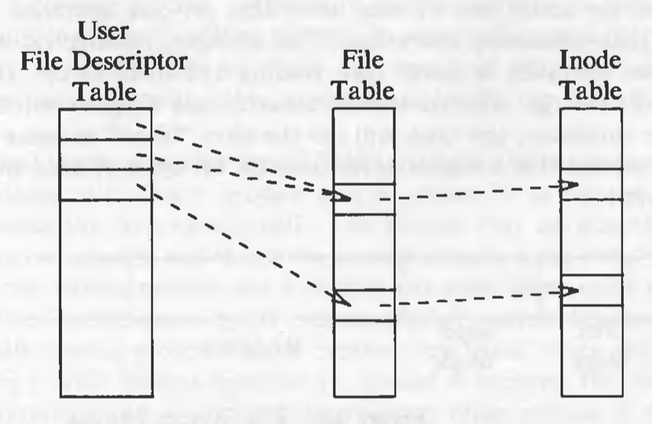
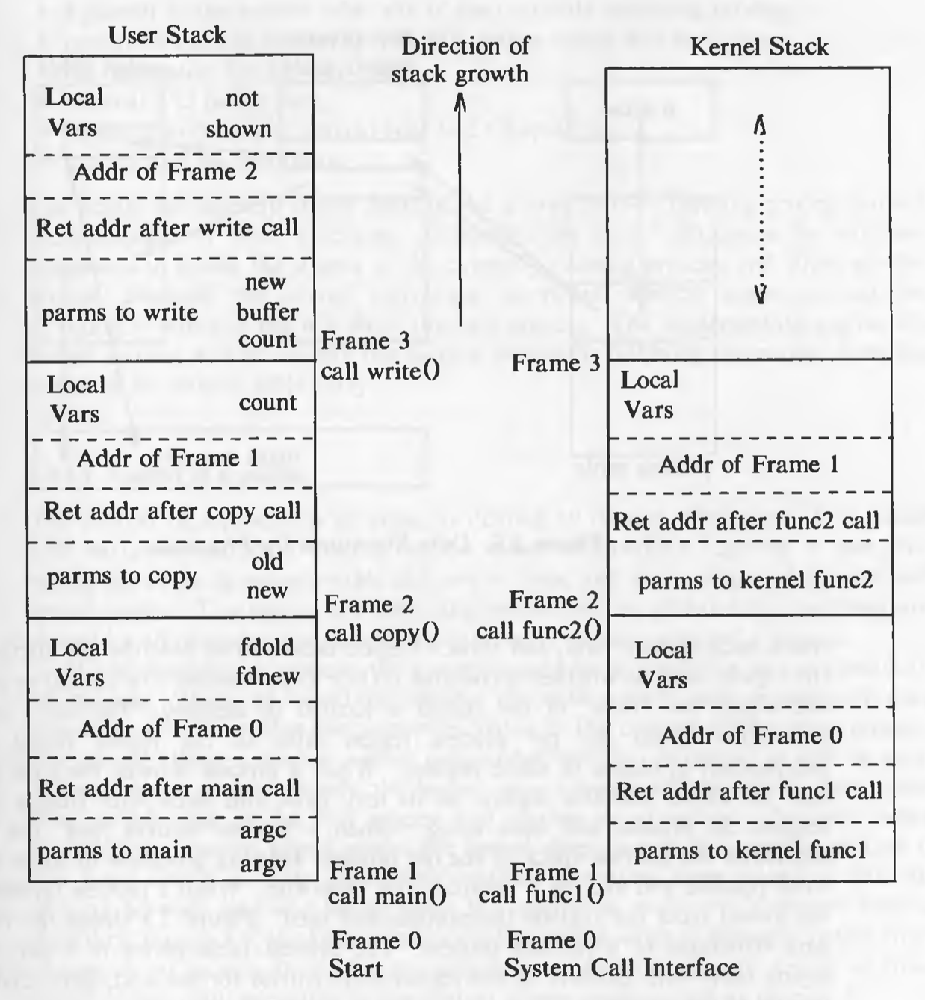
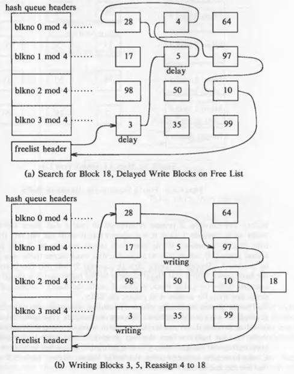
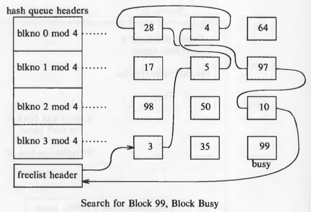

# Unit 01


---
## Why UNIX became so popular

* Portable: written in a high-level language (C), making it easy to read, understand, change, and move to other machines.
* User-Friendly: A powerful, simple interface.
* Modular: Provides primitives for complex programs.
* Organised: It uses a hierarchical file system.
* Consistent: Uses the byte stream file format.
* Device-Agnostic: Uniform device interface.
* Multi-User/Process: Concurrent execution.
* Hardware Abstraction: Portability across systems.


---
## High-level Architecture of UNIX Systems


* Layer-1: Hardware: It consists of all hardware related information.
* Layer-2: Kernel: This is the core of the Operating System. It is a software that acts as the interface between the hardware and the software. Most of the tasks like memory management, file management, network management, process management, etc., are done by the kernel.
* Layer-3: Shell commands: This is the interface between the user and the kernel. Shell is the utility that processes your requests. When you type in a command at the terminal, the shell interprets the command and calls the program that you want. There are various commands like cp, mv, cat, grep, id, wc, nroff, a.out and more.
* Layer-4: Application Layer: It is the outermost layer that executes the given external applications.
  
* The operating systems interacts directly with the hardware, providing common services to programs and insulating them from hardware idiosyncrasies.
Programs such as the shell and editors shown in the outer layers interact with the kernel by invoking a well defined set of *system calls*.


---
## User Perspective


---
### Shell

* The OS provides a command-line interface or shell to interact with files, processes, and system services
  

---
### The File System

* Hierarchical Structure: Tree-like organisation with a root ('/').
* Consistent Data: Uniform treatment of file content.
* File Management: Create and delete files easily.
* Dynamic Growth: Files can expand as needed.
* Data Protection: Security mechanisms for file access.
* Devices as Files: Unified interface for peripherals.
* Nodes:
  - Root: top-level directory.
  - Directories: Organise files (non-leaf nodes).
  - Files: Data storage (leaf nodes: directories, regular files, special device files).
 

---
### Process

* Users can run commands, scripts, and applications, and manage system resources indirectly via system calls or shell commands.
  


---
## Operating System Services

* Process Control: Allows creation, termination, suspension, and communication between processes.
* CPU Scheduling: Shares CPU time fairly among processes using time-sharing and context switching.
* Main Memory Management: Allocates memory to processes, protects address spaces, and supports memory sharing.
* Swapping/Paging: Frees memory by moving processes or pages to swap space when memory is low.
* File System Management: Allocates and reclaims secondary storage, structures the file system, and protects user data.
* Device Access: Enables controlled access to I/O devices like disks, terminals, and network interfaces.
* Transparency: Hides internal file formats and device distinctions, returning simple byte streams to processes.
* Shell Support: Provides services like input reading, process spawning, piping, and I/O redirection to enable shell functionality.
* Customizability: Supports user-built environments (e.g., custom shells) using the same kernel services.


---
## Assumptions about Hardware

* **Execution Modes**

  * User Mode: Limited access to user data and instructions.
  * Kernel Mode: Full access to system memory and devices.
  * System Calls: Switch execution from user to kernel mode.

* **Privileged Instructions**

  * Executable only in kernel mode.
  * Prevent unauthorized access to system-level operations.

* **Kernel-User Relationship**

  * Kernel runs as part of user processes.
  * Handles system-level tasks on behalf of the user process.

* **Operating System View and Hardware View**

  * OS sees which *process* is running.
  * Hardware sees which *mode* is active.

  

* **Interrupts**

  * Triggered by external devices (e.g., clock, I/O).
  * Kernel saves context, handles the event, and resumes execution.
  * Prioritized handling based on importance.

* **Exceptions**

  * Caused by process errors (e.g., divide by zero, illegal memory).
  * Handled mid-instruction and resumed afterward.
  * Treated differently from hardware interrupts.

* **Unified Handling**

  * Single mechanism used to manage both interrupts and exceptions.

* **Processor Execution Levels**

  * Kernel masks lower-priority interrupts during critical operations.
  * Execution level set using privileged instructions.

  

* **Memory Management**

  * Kernel resides permanently in main memory.
  * Compiler generates virtual addresses.
  * Kernel maps virtual to physical addresses using hardware.
  * Supports techniques like paging.


---
# Introduction to the Kernel


---
## Architecture of the UNIX Operating System

The UNIX system supports the illusions that the file system has "places" and that processes have "life".

The two entities, files and processes, are the two central concepts in the UNIX system model.


* The *file subsystem* is on the left and the *process control subsystem* is on the right.
* The diagram shows 3 levels : user, kernel, and hardware.
* The system call and library interface represent the border between user programs and the kernel.

* **Core Concepts**

  * UNIX centers around two key entities: **files** and **processes**.
  * The kernel is divided into two subsystems: **File Subsystem** and **Process Control Subsystem**.

* **System Structure**

  * Three layers: **User**, **Kernel**, and **Hardware**.
  * **System Call Interface**: Boundary between user programs and kernel.

* **Libraries and System Calls**

  * System calls look like C functions.
  * Libraries translate these into system-level operations.
  * Assembly code can call system calls directly.

* **File Subsystem**

  * Manages files, space allocation, access permissions.
  * System calls: `open`, `read`, `write`, `close`, `stat`, `chown`, `chmod`.
  * Uses **buffer cache** for efficient I/O.
  * Interacts with:

    * **Block I/O drivers** (e.g., disk).
    * **Character/raw I/O drivers** (e.g., terminals, tapes).

* **Process Control Subsystem**

  * Handles:

    * Process creation & termination
    * Process scheduling
    * Memory management
    * Inter-process communication
  * System calls: `fork`, `exec`, `exit`, `wait`, `brk`, `signal`.

* **Memory Management**

  * Allocates memory fairly across processes.
  * Swaps processes between main and secondary memory if needed.
  * Two policies: **Swapping** and **Demand Paging**.
  * **Swapper**: Manages memory allocation (not to be confused with CPU scheduler).

* **CPU Scheduler**

  * Allocates CPU based on priority and time quantum.
  * Preempts processes that exceed their time slice.

* **Interprocess Communication**

  * Includes:

    * **Signals** (asynchronous)
    * **Message passing** (synchronous)

* **Hardware Control**

  * Manages hardware interrupts (e.g., from disk or terminal).
  * Interrupts are serviced by **kernel functions**, not separate processes.
  * After servicing, the interrupted process resumes.


---
## Introduction to System Concepts


---
### An Overview of the File Subsystem

* **Inode (Index Node)**

  * Internal representation of a file.
  * Stores: file metadata (owner, permissions, timestamps, disk layout).
  * Each file has **one inode**; multiple file names (links) can map to it.
  * Assigned by kernel when a new file is created.

* **In-Core Structures**

  * **Inode Table**: Maintained in memory for file access.
  * **File Table**: Global; tracks open files, byte offset, access rights.
  * **User File Descriptor Table**: Per-process; stores open file descriptors.

* **File Access Mechanism**

  * `open()` / `creat()` create entries in all three tables.
  * File descriptor returned → index into the user file descriptor table.
  * `read()` / `write()` follow file descriptor to inode via table pointers.




---
### **Logical vs Physical Devices**

* **Logical Devices**

  * Kernel treats file systems as logical devices with unique device numbers.
  * Device drivers map **logical addresses** to **physical disk locations**.

* **Disk Usage**

  * UNIX uses **disks**, not tapes, for file systems.
  * File systems can be partitioned for easier management.

---


---
### **File System Layout**

* **Logical Block**

  * Basic unit of file system storage (typically **1K bytes**).
  * Size is uniform within a file system but can differ across systems.
  * Larger blocks = faster transfer; too large = wasted space.

---


---

* **Boot Block**

  * First block in the file system.
  * May contain bootstrap code (to boot the OS).
  * Present in all file systems (even if unused).

* **Super Block**

  * Contains metadata: size, free space, file limits.
  * Essential for managing the file system state.

* **Inode List**

  * Contains all file inodes.
  * One inode is designated as the root inode (for mounting).
  * Size set during file system configuration.

* **Data Blocks**

  * Store actual file content and admin data.
  * Each block belongs to only one file.


---
## Processes

* **Definition**

  * A process is the execution of a program.
  * Consists of: **text** (instructions), **data**, and **stack**.
  * Communicates with others via **system calls**.

---

* **Process Creation**

  * Created using the `fork()` system call.
  * **Parent process** creates a **child process**.
  * All processes (except **process 0**) are created this way.
  * **Process 0** is manually created during boot → becomes the **swapper**.
  * **Process 1 (init)** is the ancestor of all other processes.

---

* **Executable File Structure**

  * Headers: file attributes.
  * Program text: machine instructions.
  * Initialized data: stored in the executable (e.g., `int version = 1;`).
  * Uninitialized data: `bss` section (e.g., `char buffer[2048];`).
  * Other info: symbol tables, etc.

```c
char buffer[2048];  // bss
int version = 1;    // initialized data
```

---

* **Memory Regions After `exec()`**

  * **Text**: code section.
  * **Data**: initialized + bss section.
  * **Stack**: created at runtime, grows dynamically.

    * Holds: function parameters, local vars, return data.

---

* **Stacks**

  * **User Stack**: used during user mode execution.
  * **Kernel Stack**: used after system call (kernel mode).
  * Switch triggered via a **trap instruction** on system call.



---

* **Process Data Structures**

  * **Process Table**:

    * Holds global process info (PID, state, UID, etc.)
  * **u Area**:

    * Kernel-only memory space.
    * Stores process-specific runtime data.

* **Process Table Fields**

  * State (running, sleeping, etc.)
  * User ID (UID)
  * Event descriptor for sleeping state

* **u Area Fields**

  * Pointer to process table entry
  * System call parameters, return values, error codes
  * Open file descriptors
  * I/O parameters
  * Current directory and root
  * Size limits (file/process)


---

* **Memory Regions and Sharing**

  * Managed via:

    * **Per-Process Region Table** → links to global **Region Table**
  * Supports:

    * Shared memory across processes
    * Copy-on-write on `fork()`
    * Memory release on `exit()`

---


---
## Context of a process

* **Context includes:**

  * Program code (text)
  * Global variables and data
  * CPU registers
  * Process table slot
  * u area
  * User and kernel stacks

* **Not included:**

  * OS code and global kernel data (shared by all processes)

* **Context Switch:**

  * Happens when the system switches from one process to another
  * Saves current process state and loads the new one

* **Mode Switch ≠ Context Switch:**

  * Switching between user ↔ kernel mode is **not** a context switch

* **Interrupt Handling:**

  * Interrupts are served **in kernel mode**
  * Handled **within the context** of the interrupted process

---


---
## Process states

1. Process is currently executing in user mode.
2. Process is currently executing in kernel mode.
3. Process is not executing, but it is ready to run as soon as the scheduler chooses it.
4. Process is sleeping.

Because a processor can execute only one process at a time, at most one process may be in states 1 and 2.


---
## State transitions

* Processes move continuously between states according to well-defined rules.

* A **state transition diagram** represents:

  * **Nodes:** process states
  * **Edges:** events triggering transitions


* The kernel **allows context switches only** when a process moves from **kernel running** → **asleep in memory**.

* Processes running in kernel mode are **non-preemptive** (cannot be interrupted by others).

* This protects kernel data structures from corruption during critical operations.

* **Example: Inserting a node `bp1` into a doubly linked list**

  ```c
  bp1->forp = bp->forp;
  bp1->backp = bp;
  bp->forp = bp1;
  // possible context switch here
  bp1->forp->backp = bp1;
  ```

* If a context switch happens at the marked line, the linked list becomes inconsistent, risking corruption if modified by another process.


* To avoid this, the kernel:

  * Raises the **processor execution level** during **critical regions** to block interrupts.
  * Critical regions are small code sections that manipulate shared kernel data.

* User-mode processes are **periodically preempted** by the scheduler to prevent CPU monopolization.

---


---
## Sleep and wakeup

* A process decides **on its own initiative** when to sleep or wake up.

* Other processes can suggest alternatives, but a process makes the final decision.

* **Interrupt handlers cannot sleep**, because that would suspend the interrupted process by default.

* Processes **sleep on an event**, meaning:

  * They remain in the **sleep state** until the event occurs.
  * When the event occurs, **all processes sleeping on that event wake up**.
  * They move from **sleep** → **ready-to-run** state (not running immediately).
  * Sleeping processes **do not consume CPU**; the kernel waits for events to wake them.

* When modifying critical data structures, the kernel:

  * Checks if a lock (condition) is set by another process.
  * If locked, process **sleeps on the event** that the lock becomes free.
  * When unlocked, the process wakes up and locks the resource to proceed.

* Kernel locking mechanism:

  ```c
  while (condition is true)
      sleep(event: condition becomes false);
  set condition true;
  ```

* Unlocking and waking up waiting processes:

  ```c
  set condition false;
  wakeup(event: condition is false);
  ```

* **Example:** Three processes (A, B, C) contend for the same locked buffer:

  * All sleep on the buffer lock event.
  * When unlocked, all wake up and move to ready state.
  * Kernel picks one (say B), which locks the buffer and proceeds.
  * Others (A, C) sleep again if the buffer remains locked.


---
## Kernel Data Structures

* Kernel data structures mostly use **fixed-size tables** instead of dynamic allocation.
* **Advantage:** Simpler kernel code and easier algorithms.
* **Disadvantage:** Limited number of entries based on initial configuration.

  * If the system runs out of entries, it **cannot allocate more dynamically** and must return an error.
  * Over-provisioning wastes memory but ensures stability.
* Kernel algorithms often use **simple loops** to find free entries, prioritizing simplicity and efficiency over complex allocation schemes.

---


---
## System Administration

* Administrative processes perform tasks for the overall welfare of users, e.g.,

  * Disk formatting
  * Creating and repairing file systems
  * Kernel debugging
* These processes use the **same system calls** as regular user processes.
* Difference: They have **special rights and privileges**.
* The kernel distinguishes a **superuser** with elevated privileges.
* A user becomes superuser by:

  * Logging in with special credentials
  * Running special programs
* The kernel treats administrative processes like normal processes but enforces privilege-based access control.

---


---
# The Buffer Cache

**Purpose:**
The buffer cache is an internal memory pool that the kernel uses to cache recently accessed disk blocks. It helps minimize slow disk I/O operations by keeping frequently accessed data in faster main memory.

---


---
### How Buffer Cache Works:

* When a process requests file data, the kernel first checks the buffer cache.
* If the data is in the cache (**cache hit**), the kernel serves it directly from memory—avoiding disk access.
* If not (**cache miss**), the kernel reads the data from disk into the buffer cache, then provides it to the process.
* Similarly, when writing, data is cached first and written to disk later (**delayed write**) to reduce disk write frequency.

---


---
### Placement in Kernel Architecture:

* Buffer cache sits between the **file subsystem** (which manages files and directories) and **block device drivers** (which handle the actual disks).
* It acts as a bridge, caching disk blocks for faster access.

---


---
### Key Data Structures Cached:

* **File data blocks**: Actual content of files.
* **Super block**: Metadata describing the file system structure and free space.
* **Inode**: Metadata describing individual files (file layout, permissions, etc.).

---


---
### Advantages of Buffer Cache:

* **Reduces disk I/O:** By keeping frequently accessed blocks in memory.
* **Speeds up access:** Memory access is significantly faster than disk.
* **Improves system performance:** Enhances overall throughput and responsiveness.

---


---
### Disadvantages of Buffer Cache:

* **Memory overhead:** Consumes part of main memory.
* **Added complexity:** Kernel algorithms for caching and eviction become more complex.
* **Risk of data loss:** If data is delayed-written and the system crashes, unsaved changes might be lost.

---


---
### Summary:

The buffer cache optimizes file system performance by caching disk blocks in main memory. It balances between fast memory access and the slow disk, using algorithms to decide what to keep or write back to disk, improving both read and write efficiency.

---


---
## Buffer Headers

During system initialization, the kernel allocates **buffers**, which are used to temporarily hold disk data in memory. Each buffer consists of:

* **Memory array**: Stores the actual data copied from a disk block.
* **Buffer header**: Metadata that identifies and manages the buffer.

---


---
### Key Concepts

* **Data association**: Each buffer corresponds to a specific logical disk block in a filesystem.
* **Uniqueness**: A disk block can only be mapped to one buffer at a time.
* **Identification**: Buffers are uniquely identified by two numbers:

  * **Device number**: Logical filesystem identifier (not physical device).
  * **Block number**: Position of the data block on the disk.

Together, these uniquely specify the buffer.

---


---
### Buffer Header Components


* **Status Field**: Indicates the current state of the buffer, which can include:

  * **Locked/Busy**: The buffer is currently in use.
  * **Valid Data**: The buffer contains up-to-date data.
  * **Delayed-write**: Data must be written to disk before buffer reuse.
  * **I/O in Progress**: Kernel is currently reading or writing the buffer.
  * **Wait Flag**: One or more processes are waiting for the buffer to become free.

* **Data Pointer**: Points to the memory area holding the disk block data. Size must match or exceed the disk block size.

* **Queue Pointers**: Two sets of pointers forming doubly linked circular lists for traversing buffer queues efficiently.

---


---
## Structure of the Buffer Pool

* The kernel uses the **Least Recently Used (LRU)** algorithm for managing the buffer pool.
* It maintains a **free list** of buffers preserving the LRU order.
* A **dummy buffer header** marks the start and end of the free list.
* At system boot, **all buffers** are placed on the free list.
* When the kernel needs **any free buffer**, it takes one from the **head** of the free list.
* It can also take a **specific buffer** from anywhere in the free list.
* When used buffers become free, they are attached to the **tail** of the free list.
* Buffers closer to the **head** of the free list are the **least recently used**.


*Free list of buffers*

---

* When accessing a disk block, the kernel searches for a buffer with the matching **device-block number** combination.
* To avoid searching the entire buffer pool, buffers are organized into **hash queues**.
* Hash queues are also **doubly linked circular lists**.
* A **hash function** distributes buffers uniformly across these queues.
* The hash function must be **simple** to maintain performance.


*Buffers on the Hash Queues*

---

* The example hash function depends only on the block number; real systems also use the device number.
* Each disk block exists on **one and only one hash queue**, and only once on that queue.
* A buffer's presence on a hash queue does not imply it is busy; it may also be on the free list if free.
* To find a **specific buffer**, the kernel searches the hash queue.
* To find **any free buffer**, the kernel removes one from the free list.

**Key point:**
A buffer is **always on a hash queue**, but it **may or may not be on the free list**.

---


---
## Scenarios for Retrieval of a Buffer

The algorithms for reading and writing disk blocks use the algorithm *getblk* to allocate buffers from the pool. There are 5 typical scenarios the kernel may follow in *getblk* to allocate a buffer for a disk block.

* Found & Free: Block in hash queue, buffer free (mark busy, remove from free list).
* Found, Busy: Block in hash queue, buffer busy, sleep until free.
* Not Found, Free Buffer: Block not in hash queue, allocate from free list (remove from old hash, add to new hash).
* Not Found, Delayed Write: Allocate "delayed write" buffer, write to disk, retry.
* Not Found, No Free: Free list empty, sleep until a buffer is free.

1. Block is found on its hash queue and its buffer is free.
2. Block could not be found on the hash queue, so a buffer from the free list is allocated.
3. Block could not be found on the hash queue, and when allocating a buffer from free list, a buffer marked "delayed write" is allocated. Then the kernel must write the "delayed write" buffer to disk and allocate another buffer.
4. Block could not be found on the hash queue and the free list of buffers is empty.
5. Block was found on the hash queue, but its buffer is currently busy.

The algorithm *getblk* is given below (scenarios stated above are marked in the comments) :

```
/*
 *  Algorithm: getblk
 *  Input: file system number
 *          block number
 *  Output: locked buffer that can now be used for block
 */

{
	while (buffer not found)
	{
		if (block in hash queue)
		{
			if (buffer busy)   // scenario 5
			{
				sleep (event: buffer becomes free);
				continue;      // back to while loop
			}
			mark buffer busy;  // scenario 1
			remove buffer from free list;
			return buffer;
		}
		else
		{
			if (there are no buffers on the free list)
			{
				sleep (event: any buffer becomes free);   // scenario 4
				continue;      // back to while loop
			}
			remove buffer from free list;
			if (buffer marked for delayed write)         // scenario 3
			{
				asynchronous write buffer to disk;
				continue:      // back to while loop;
			}
			// scenario 2
			remove buffer from old hash queue;
			put buffer onto new hash queue;
			return buffer;
		}
	}
}

```

When using the buffer, the kernel always marks the buffer as busy so that no other process can access it. When the kernel finishes using the buffer, it releases the buffer according to the algorithm *brelse*.

The algorithm *brelse* is given below :

```
/*  Algorithm: brelse
 *  Input: locked buffer
 *  Output: none
 */
 
{
	wakeup all processes (event: waiting for any buffer to become free;
	wakeup all processes (event: waiting for this buffer to become free;
	raise processor execution level to block interrupts;
	if (buffer contents valid and buffer not old)
		enqueue buffer at end of free list;
	else
		enqueue buffer at beginning of free list;
	lower processor execution level to allow interrupts;
	unlock (buffer);
} 
```

Buffer contents are old only if it is marked as "delayed write", in that case and in the case where the data is not valid (for example, due to I/O corruption), the buffer is put in the beginning of the free list as its data is not valid or old. Otherwise the data is valid as the buffer is put at the end to follow the LRU strategy.

The states of hash queues for different scenarios are shown in following figures :

Scenario 1


Scenario 2

Here the buffer is not on the hash queue, so a buffer from free list is removed and then its device and block numbers are changed.


Scenario 3



Scenario 4


Race for free buffer


Scenario 5



Race for a locked buffer **(this is an important race condition)**


**The kernel guarantees that all processes waiting for buffers will wake up, because it allocates buffers during execution of system calls and frees them before returning.**


---
## Reading and Writing Disk Blocks

This is the algorithm (*bread*) for reading data from the disk:

```
/*  Algorithm: bread
 *  Input: file system number
 *         block number
 *  Output: buffer containing data
 */
 
{
	get buffer for block (algorithm: getblk);
	if (buffer data valid)
		return buffer;
	initiate disk read;
	sleep (event: disk read complete);
	return buffer;
}
```

If the data is not found in the buffer pool, the kernel initiates disk read. The driver "schedules" a read request to the disk controller, which copies the data from the disk to the buffer and then the disk interrupt handler awakens the sleeping process.

The higher level algorithms anticipate the need for the next disk block if a sequential file access is being done. The second read is asynchronous. The kernel expects the data to be there for the second block when it wants.

The algorithm *breada* (bread-ahead) is given below:

```
/*  Algorithm: breada
 *  Input: file system number and block number for immediate read
 *         file system number and block number for asynchronous read
 *  Output: buffer containing data for immediate read
 */
 
{
	if (first block not in cache)
	{
		get buffer for first block (algorithm: bread);
		if (buffer data not valid)
			initiate disk read;
	}
	if (second block not in cache)
	{
		get buffer for second block (algorithm: getblk);
		if (buffer data valid)
			release buffer (algorithm: brelse);
		else
			initiate disk read;
	}
	if (first block was originally in the cache)
	{
		read first block (algorithm: bread);
		return buffer;
	}
	sleep (event: first buffer contains valid data);
	return buffer;
}
```

Note: in the algorithm above, the line: `get buffer for first block (algorithm: bread)` is not correct in my opinion. The algorithm here should be `getblk` and not `bread` as we are checking for validity and initiating a disk read both of which are done internally in `bread`. So the algorithm here should be `getblk`. It might just be a printing mistake in the book.

If we get the data for the second block in the buffer cache, we release it immediately as we do not need it right away. It will be acquired when the data is actually needed.

The algorithm (*bwrite*) for writing contents of a buffer to a disk block is given below:

```
/*  Algorithm: bwrite
 *  Input: buffer
 *  Output: none
 */

{
	initiate disk write;
	if (I/O synchronous)
	{
		sleep (event: I/O complete);
		release buffer (algorithm: brelse);
	}
	else if (buffer marked for delayed write)
			mark buffer to put at head of free list;
}
```

Because of the two asynchronous I/O operations -- block read ahead and delayed write -- the kernel can invoke *brelse* from an interrupt handler. Hence, it must prevent interrupts in any procedure that manipulates the buffer free list.
